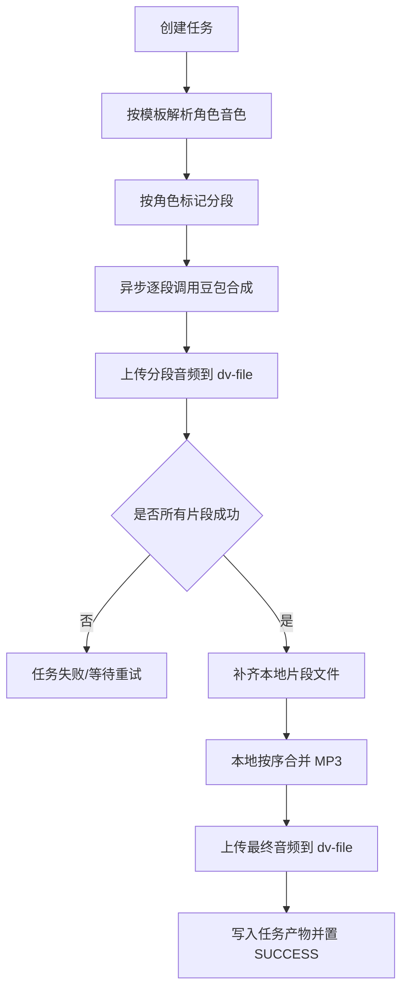

# 音频任务设计文档

## 1. 模块目标

`dv-audio` 的音频任务能力用于把多角色对话文本转成最终 MP3，支持模板化角色映射、异步执行、失败重试、结果查询与预览下载。

## 2. 设计范围

本设计覆盖 `AudioTaskController -> AudioTaskService -> AudioTaskDomainService` 这一条任务链路，不包含 `voice/template` 的模板维护详细设计（模板设计见 `audio-voice-template-设计文档.md`）。

## 3. 对外接口边界

- 模块基础路径：`/tasks`
- 网关前缀：`/audio`
- 前端统一走：`/audio/tasks/**`

核心接口：
- 创建任务、任务详情、片段列表
- 片段编辑/重排/删除、单片段重跑、重试失败片段、重新合成音频、取消任务
- 结果查询、下载地址、分页查询、删除任务

## 4. 关键数据模型

### 4.1 任务主表 `audio_task`

关键字段：
- `id` 任务ID
- `task_no` 任务编号
- `task_name` 任务名称
- `raw_text` 原始文本
- `section_id` 会话ID（服务端生成）
- `template_id` 音色模板ID
- `status` 任务状态
- `final_oss_url` 最终音频地址
- `final_duration_ms` 最终时长
- `error_msg` 错误信息

### 4.2 任务片段 `audio_segment`

关键字段：
- `task_id` 任务ID
- `segment_no` 片段序号
- `role_name` 角色名
- `speaker_code` 音色编码
- `text_content` 片段文本
- `status` 片段状态
- `retry_count` 重试次数
- `request_id` 合成请求ID

### 4.3 片段文件 `audio_segment_file`

关键字段：
- `segment_id`
- `oss_url`
- `duration_ms`
- `file_size`

### 4.4 任务产物 `audio_task_output`

关键字段：
- `task_id`
- `output_type`（当前主要为 `FINAL_MP3`）
- `oss_url`
- `duration_ms`
- `file_size`

## 5. 状态机

任务状态：
- `CREATED`
- `SYNTHESIZING`
- `MERGING`
- `SUCCESS`
- `FAILED`
- `CANCELED`

片段状态：
- `PENDING`
- `RUNNING`
- `SUCCESS`
- `FAILED`

取消语义：
- 调用取消接口后，任务置为 `CANCELED`。
- 异步执行线程在关键步骤检查取消状态并提前退出，避免被后续异常覆盖为 `FAILED`。

## 6. 业务流程



## 7. 分段策略

模板驱动分段：
- 根据 `audio_voice_template_item.role_name` 动态构建角色标记集合。
- 文本直接按模板角色标记出现位置切段，不依赖换行或冒号。
- 输入示例：
  ```text
  [甲] 第一段内容
  [乙]
  第二段内容
  [甲]
  第三段内容
  ```
- 若整段文本未匹配到模板角色标记，直接报业务错误（`12008`），不再回退到按冒号分段。

## 8. 存储与文件路径

上传通过 Feign 调 `dv-file`：
- 片段上传：`uploadSegment`
- 最终上传：`uploadFinal`

业务路径规则：
- `audio/yyyyMMdd/{sectionId}/...`
- `sectionId` 同一任务内固定，保证同会话落同目录。

## 9. 本地临时文件策略

设计上区分“本地临时工作目录”和“OSS持久化地址”：
- 片段合成先落本地临时目录
- 上传到 OSS（dv-file）
- 合并前若某些历史成功片段不在本地，则按 `ossUrl` 下载回本地
- 本地完成最终合并后再上传最终 MP3

这样可以兼容“仅重试失败片段后自动合并”的场景。

本地目录约定：
- 统一根目录：`audio.storage.local-base-dir`
- 当前默认值：`E:/WorkSoftWare/IdeaProject/tempFile/dv-audio`
- 任务执行目录：
  - `segment/{taskNo}/...`
  - `download/{taskNo}/...`
  - `merge/{taskNo}/final.mp3`

## 10. 失败重试策略

- `retry`：重跑所有非 `SUCCESS` 片段（请求豆包），成功片段复用历史产物，最终自动合并。
- `retry-all`：仅重新合成最终音频，不请求豆包；前提是所有片段状态为 `SUCCESS`。
- `segments/{segmentId}/retry`：只重跑单片段，更新片段音频，不触发最终合并。
- “单段音色不满意但状态为成功”的业务场景：先调用单片段重跑，再调用 `retry-all` 重新合成。

并发与状态保护：
- 任务在 `CREATED/SYNTHESIZING/MERGING` 期间不允许重复重试，避免并发重复调用合成。
- 取消状态优先级高于合并成功写回，避免被后续状态覆盖。

片段编辑后的状态约定：
- 编辑文案、调整顺序、删除片段后，任务状态重置为 `CREATED`，表示“待重新生成”。
- 该状态下允许继续编辑片段，也允许后续触发单片段重跑、`retry` 或 `retry-all`。

合并前校验：
- 进入 `MERGING` 前会强校验所有片段状态必须为 `SUCCESS`。
- 如存在非成功片段，直接拒绝合并并返回未成功片段序号，避免产出不完整音频。

## 11. 删除策略

删除任务时同步删除以下关联记录：
- `audio_segment`
- `audio_segment_file`
- `audio_task_output`
- `audio_task_log`
- `audio_segment_log`

当前仅删除数据库记录，不主动删除 OSS 文件。

## 12. 设计约束与约定

1. 创建任务不接收前端 `sectionId`，由服务端统一生成。
2. 角色与音色映射必须来源于模板，不接受临时传入映射。
3. 文本分段按模板配置动态解析，不写死“甲乙”。
4. 最终结果地址即播放地址，前端可直接 `<audio>` 预览。
5. 合并依赖 `ffmpeg`，通过 `audio.ffmpeg.command` 指定命令或绝对路径。
