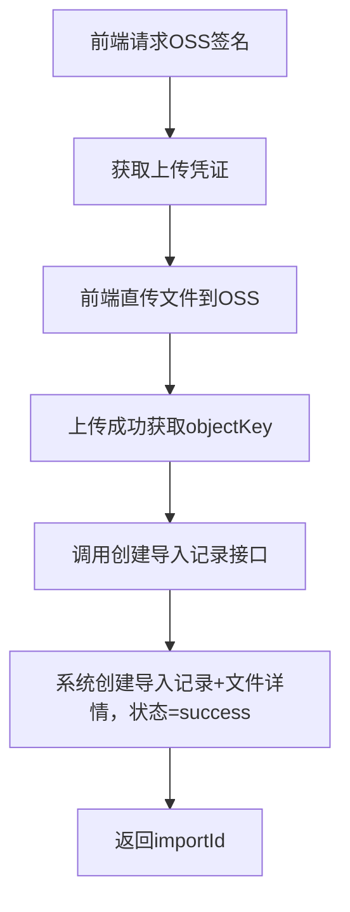
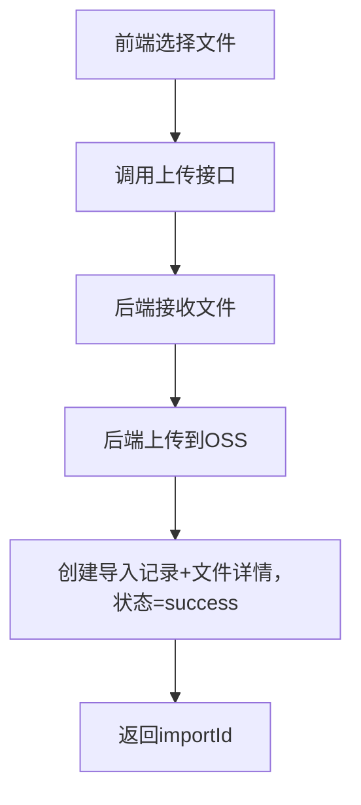

# 文件导入模块 - 业务流程文档

## 1. 模块概述
- **功能描述**：提供统一的文件导入功能，支持前端直传OSS或后端代理上传，记录导入日志和文件详情
- **适用场景**：Excel/CSV等文件导入业务数据（如成交记录、电费账单等）
- **前置条件**：用户需要登录，具有对应模块的数据导入权限

## 2. 核心业务流程

### 2.1 流程图（前端直传OSS方式 - 推荐）



### 2.2 流程图（后端代理上传方式 - 备选）



### 2.3 步骤说明

| 步骤 | 操作 | 接口 | 说明 |
|------|------|------|------|
| 1 | 获取OSS签名 | GET /file/fileImport/sign | 传入moduleType（如stock、electricity） |
| 2 | 前端直传OSS | - | 使用签名直接上传到OSS，获取filePath |
| 3 | 创建导入记录 | POST /file/fileImport/add | 传入bizType + objectKey + fileName，文件大小后端自动获取 |
| 4 | 查询导入记录 | POST /file/fileImport/page/list | 分页查询导入历史 |
| 5 | 查看文件详情 | POST /file/fileImport/detail/page/list | 查看文件的OSS信息 |

## 3. 数据流向

```
前端直传方式：
前端 → OSS（上传文件）→ 获取objectKey
     → 后端（创建导入记录，传objectKey+原始文件名）→ import_record表(success) + file_detail表(success)

后端代理方式：
前端 → 后端（上传文件）→ OSS → import_record表(success) + file_detail表(success)

说明：
- dv-file只负责文件上传和记录，不负责业务解析
- 导入记录创建成功即状态为success，无需轮询
- 业务处理（如Excel解析入库）由各业务模块自行实现，其处理状态不在dv-file管理范围内

文件名说明：
- fileName（原始文件名）：用户选择的文件名，如"电量表7-8月部分.xlsx"，前端直传时由前端传入
- storedFileName（存储文件名）：OSS上的UUID文件名，如"abc123.xlsx"，后端从objectKey自动提取
```

## 4. 数据库表结构

### 4.1 import_record（导入记录表）

| 字段 | 类型 | 说明 |
|------|------|------|
| import_id | BIGINT | 导入ID（主键） |
| user_id | BIGINT | 用户ID |
| dept_id | BIGINT | 部门ID |
| biz_type | VARCHAR(32) | 业务类型(import_biz_type) |
| status | VARCHAR(32) | 导入状态（import_status: success=成功, fail=失败） |
| error_msg | TEXT | 错误信息 |
| create_by | VARCHAR(64) | 创建者 |
| create_time | DATETIME | 创建时间 |
| update_by | VARCHAR(64) | 更新者 |
| update_time | DATETIME | 更新时间 |
| is_deleted | CHAR | 删除标志（0存在 1删除） |
| remark | VARCHAR(500) | 备注 |

### 4.2 file_detail（文件详情表）

| 字段 | 类型 | 说明 |
|------|------|------|
| detail_id | BIGINT | 明细ID（主键） |
| import_id | BIGINT | 导入ID（关联import_record） |
| file_name | VARCHAR(255) | 原始文件名（用户选择的文件名，如：电量表7-8月部分.xlsx） |
| stored_file_name | VARCHAR(255) | 存储文件名（OSS上的UUID文件名，如：abc123.xlsx） |
| file_type | VARCHAR(32) | 文件类型(xlsx/xls/csv等) |
| file_size | BIGINT | 文件大小(字节) |
| bucket_name | VARCHAR(64) | OSS存储桶名称 |
| oss_host | VARCHAR(255) | OSS访问域名 |
| file_path | VARCHAR(500) | OSS文件路径(含目录前缀) |
| status | VARCHAR(32) | 文件状态（import_file_status: success=成功, fail=失败） |
| error_msg | VARCHAR(500) | 错误信息 |
| create_by | VARCHAR(64) | 创建者 |
| create_time | DATETIME | 创建时间 |
| update_by | VARCHAR(64) | 更新者 |
| update_time | DATETIME | 更新时间 |
| is_deleted | CHAR | 删除标志（0存在 1删除） |
| remark | VARCHAR(500) | 备注 |

### 4.3 表关系


- 一个导入记录(import_record)可关联多个文件详情(file_detail)
- 文件的OSS信息存储在file_detail中，避免联表查询

## 5. 权限规则

### 5.1 查询权限
- **超级管理员**：可查询所有用户的导入记录和文件详情
- **普通用户**：只能查询自己的导入记录和文件详情

### 5.2 权限实现
- 权限逻辑在 Service 层实现
- Controller 层不处理权限判断
- 自动从 SecurityContext 获取当前用户信息

## 6. 文件路径规范

OSS 文件存储路径结构：
```
{uploadDirPrefix}/{moduleType}/{YYYYMMDD}/{uuid}.{ext}
```

示例：
```
uploads/stock/20260411/a1b2c3d4-e5f6-7890-abcd-ef1234567890.xlsx
uploads/electricity/20260411/b2c3d4e5-f6a7-8901-bcde-f12345678901.csv
```

## 7. 字典配置

> **重要**：本项目使用自定义字典表 `sys_dict` 和 `sys_dict_detail`，不使用若依框架的 `sys_dict_type` 和 `sys_dict_data` 表。

### 7.4 字典查询接口

| 字典code | 查询接口 | 说明 |
|----------|----------|------|
| import_biz_type | GET /system/dict/detail/list/import_biz_type | 业务类型字典 |
| import_status | GET /system/dict/detail/list/import_status | 导入状态字典 |
| import_file_status | GET /system/dict/detail/list/import_file_status | 文件状态字典 |

#### 响应示例
```json
{
  "code": 200,
  "msg": "操作成功",
  "data": [
    {
      "id": 1,
      "dictCode": "import_biz_type",
      "dictLabel": "电费",
      "dictValue": "electricity",
      "remark": "电费账单导入"
    },
    {
      "id": 2,
      "dictCode": "import_biz_type",
      "dictLabel": "股票",
      "dictValue": "stock",
      "remark": "股票数据导入"
    }
  ]
}
```

### 7.5 import_biz_type（业务类型）
| 字典值 | 字典标签 | 说明 |
|--------|----------|------|
| electricity | 电费 | 电费账单导入 |
| stock | 股票 | 股票数据导入 |

### 7.6 import_status（导入状态）
| 字典值 | 字典标签 | 说明 |
|--------|----------|------|
| pending | 待处理 | 文件已上传，等待处理 |
| processing | 处理中 | 文件正在处理中 |
| success | 导入成功 | 文件导入成功完成 |
| partial_fail | 部分失败 | 文件导入部分数据失败 |
| fail | 导入失败 | 文件导入全部失败 |

### 7.7 import_file_status（文件状态）
| 字典值 | 字典标签 | 说明 |
|--------|----------|------|
| pending | 待处理 | 文件等待处理 |
| processing | 处理中 | 文件正在处理 |
| success | 处理成功 | 文件处理成功 |
| fail | 处理失败 | 文件处理失败 |

> 注：业务解析状态由各业务模块自行管理，不在dv-file管理范围内。

## 8. 错误处理

| 错误场景 | 错误信息 | 处理建议 |
|----------|----------|----------|
| 未登录 | 请先登录 | 检查登录状态 |
| 文件过大 | 文件大小超出限制 | 检查文件大小限制配置 |
| 文件类型不支持 | 不支持的文件格式 | 使用支持的格式（xlsx、csv等） |
| OSS上传失败 | 上传失败，请重试 | 检查OSS配置和网络 |
| 文件解析失败 | 文件格式错误 | 检查文件内容是否符合模板 |
| 无权限查看 | 无权访问该记录 | 只能查看自己的导入记录 |

## 9. 前端对接建议

### 9.1 推荐实现方式（前端直传OSS）
```javascript
// 1. 获取OSS签名
const signRes = await axios.get('/file/fileImport/sign', {
  params: { moduleType: 'stock' }
});

// 2. 直传OSS（使用OSS SDK）
// 重要：objectKey中的文件名必须使用UUID，禁止使用原始文件名（避免中文编码问题和同名覆盖）
const uuid = crypto.randomUUID().replace(/-/g, '');
const ext = file.name.substring(file.name.lastIndexOf('.')); // 文件后缀，如 .xlsx
const objectKey = signRes.data.dir + uuid + ext; // 如：uploads/stock/20260413/a1b2c3d4.xlsx
const uploadResult = await uploadToOSS(file, signRes.data, objectKey);

// 3. 创建导入记录（传objectKey和原始文件名，文件大小后端自动获取）
const recordRes = await axios.post('/file/fileImport/add', {
  bizType: 'stock',
  objectKey: objectKey,  // OSS上的完整路径（含UUID文件名）
  fileName: file.name    // 用户选择的原始文件名，如：电量表7-8月部分.xlsx
});

// 创建成功即导入完成（状态为success），无需轮询
const importId = recordRes.data;
```

