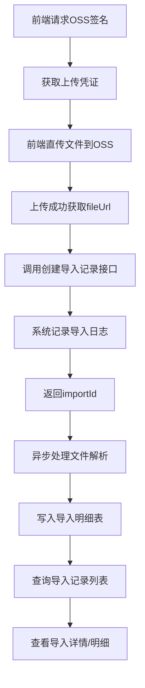
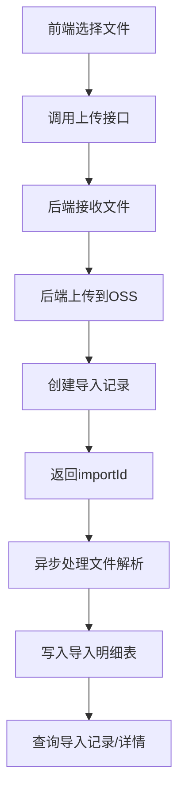

# 文件导入模块 - 业务流程文档

## 1. 模块概述
- **功能描述**：提供统一的文件导入功能，支持前端直传OSS或后端代理上传，记录导入日志和明细
- **适用场景**：Excel/CSV等文件导入业务数据（如成交记录、持仓数据等）
- **前置条件**：用户需要登录，具有对应模块的数据导入权限

## 2. 核心业务流程

### 2.1 流程图（前端直传OSS方式 - 推荐）



### 2.2 流程图（后端代理上传方式 - 备选）



### 2.3 步骤说明

| 步骤 | 操作 | 接口 | 说明 |
|------|------|------|------|
| 1 | 获取OSS签名 | GET /fileImport/sign | 传入moduleType（如stock、fund） |
| 2 | 前端直传OSS | - | 使用签名直接上传到OSS，获取fileUrl |
| 3 | 创建导入记录 | POST /fileImport/record | 传入fileUrl和dataType |
| 4 | 查询导入记录 | POST /fileImport/records/query | 分页查询导入历史 |
| 5 | 查看导入详情 | POST /fileImport/{importId}/details/query | 查看每条数据的导入状态 |

## 3. 数据流向

```
前端直传方式：
前端 → OSS（上传文件）→ 获取fileUrl
     → 后端（创建导入记录）→ 导入记录表
     → 异步处理 → 导入明细表

后端代理方式：
前端 → 后端（上传文件）→ OSS → 导入记录表 → 异步处理 → 导入明细表
```

## 4. 权限规则

### 4.1 查询权限
- **超级管理员**：可查询所有用户的导入记录和详情
- **普通用户**：只能查询自己的导入记录和详情

### 4.2 权限实现
- 权限逻辑在 Service 层实现
- Controller 层不处理权限判断
- 自动从 SecurityContext 获取当前用户信息

## 5. 文件路径规范

OSS 文件存储路径结构：
```
{moduleType}/{YYYYMMDD}/{uuid}.{ext}
```

示例：
```
stock/20260411/a1b2c3d4-e5f6-7890-abcd-ef1234567890.xlsx
fund/20260411/b2c3d4e5-f6a7-8901-bcde-f12345678901.csv
```

## 6. 特殊说明

### 6.1 两种上传方式
- **前端直传（推荐）**：性能好，减轻服务器压力，适合大文件
- **后端代理**：实现简单，适合小文件或安全性要求高的场景

### 6.2 异步处理
- 文件导入采用异步处理机制
- 创建导入记录后立即返回 importId
- 后台异步解析文件并写入明细
- 前端可通过查询接口查看导入进度和状态

### 6.3 数据类型（dataType）
- 用于区分不同业务模块的导入数据
- 常见值：`stock`（股票）、`fund`（基金）、`default`（默认）
- 需要与业务模块的字典配置一致

## 7. 错误处理

| 错误场景 | 错误信息 | 处理建议 |
|----------|----------|----------|
| 未登录 | 请先登录 | 检查登录状态 |
| 文件过大 | 文件大小超出限制 | 检查文件大小限制配置 |
| 文件类型不支持 | 不支持的文件格式 | 使用支持的格式（xlsx、csv等） |
| OSS上传失败 | 上传失败，请重试 | 检查OSS配置和网络 |
| 文件解析失败 | 文件格式错误 | 检查文件内容是否符合模板 |
| 无权限查看 | 无权访问该记录 | 只能查看自己的导入记录 |

## 8. 导入状态说明

### 业务状态（businessStatus）
- **0**：待处理
- **1**：处理中
- **2**：导入成功
- **3**：导入失败
- **4**：部分成功

## 9. 前端对接建议

### 9.1 推荐实现方式
```javascript
// 1. 获取OSS签名
const signRes = await axios.get('/fileImport/sign', {
  params: { moduleType: 'stock' }
});

// 2. 直传OSS（使用OSS SDK）
const fileUrl = await uploadToOSS(file, signRes.data);

// 3. 创建导入记录
const recordRes = await axios.post('/fileImport/record', {
  fileUrl: fileUrl,
  dataType: 'stock'
});

const importId = recordRes.data;

// 4. 轮询查询导入状态
const checkStatus = setInterval(async () => {
  const detailsRes = await axios.post(`/fileImport/${importId}/details/query`, {
    pageNum: 1,
    pageSize: 10
  });
  
  // 检查是否全部处理完成
  if (allProcessed(detailsRes.data)) {
    clearInterval(checkStatus);
    showMessage('导入完成');
  }
}, 2000);
```

### 9.2 用户体验优化
- 上传时显示进度条
- 导入中显示加载动画
- 完成后显示成功/失败统计
- 支持查看导入失败的详细原因
