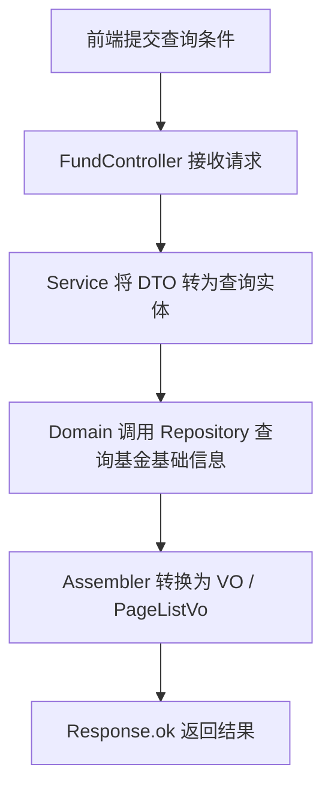
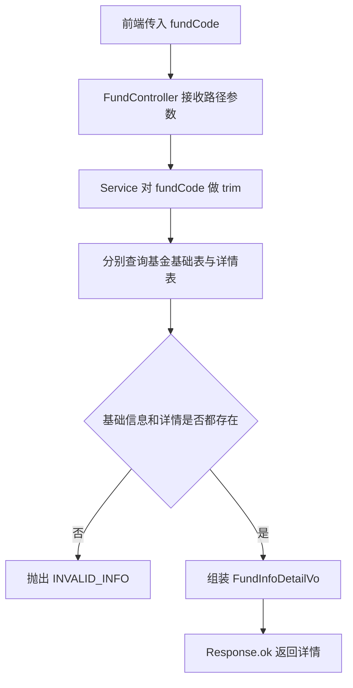
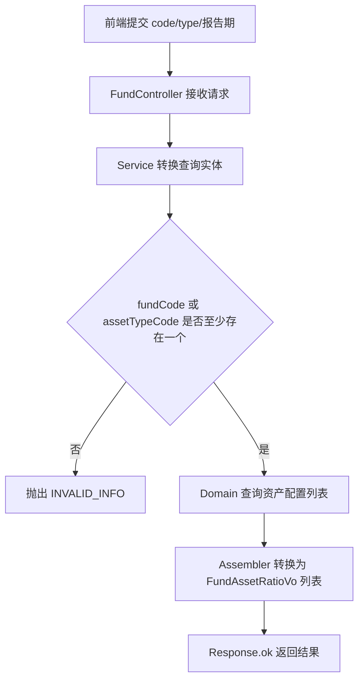
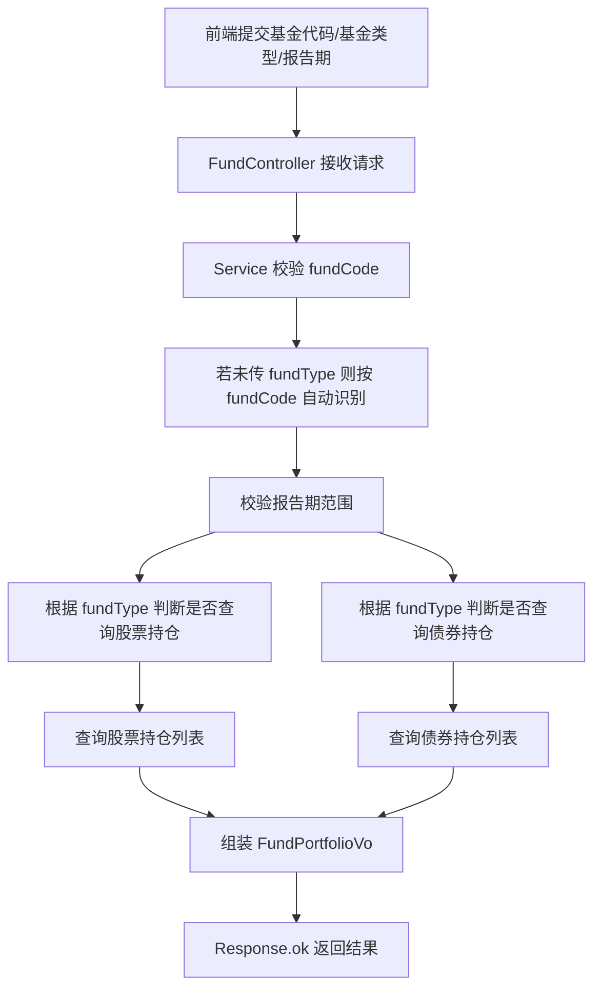
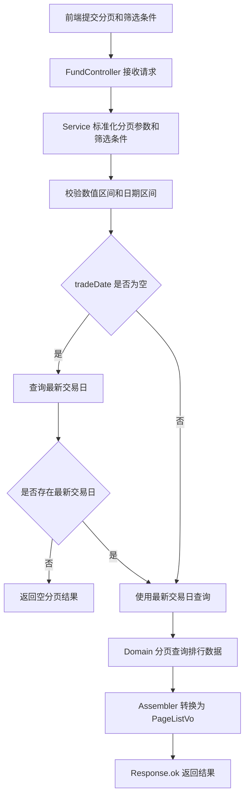

# 公募基金模块 - 业务流程文档

## 1. 模块概述
- **功能描述**：提供公募基金基础信息、详情、资产配置、持仓明细、场内基金交易排行等查询能力。
- **接口范围**：本文档仅覆盖 `dv-stock` 模块中 `FundController` 暴露的查询接口。
- **调用方式**：统一通过 `Response<T>` 返回结果，分页接口返回 `PageListVo<T>`。
- **适用场景**：基金列表检索、基金详情展示、持仓分析、资产配置分析、排行页展示。

## 2. 核心业务流程

### 2.1 基金基础信息查询流程



说明：
- 对应接口：`POST /fund/page/list`、`POST /fund/list`
- 常用筛选项：基金代码、基金简称、基金类型、是否有效

### 2.2 基金详情查询流程



说明：
- 对应接口：`GET /fund/detail/{fundCode}`
- 基金详情依赖基础信息与详情信息同时存在，缺一则返回业务异常

### 2.3 资产配置查询流程



说明：
- 对应接口：`POST /fund/assetRatio/list`
- 至少要有一个核心筛选条件：基金代码或资产类型编码

### 2.4 基金持仓查询流程



说明：
- 对应接口：`POST /fund/portfolio/list`
- `fundType` 可不传，系统会根据 `fundCode` 自动补全
- 返回结果中通过 `queryStock`、`queryBond` 明确本次是否查询了股票/债券持仓

### 2.5 场内基金交易排行查询流程



说明：
- 对应接口：`POST /fund/exchangeRank/page/list`
- `tradeDate` 不传时，系统会自动回退到最新交易日
- `orderBy` 仅允许白名单字段，否则返回业务异常

## 3. 数据流向

```text
前端请求
  -> FundController
  -> SysFundInfoService
  -> SysFundInfoDomainService
  -> Repository / Mapper
  -> 数据库基金相关表
  -> Assembler 转换 VO
  -> Response 返回前端
```

说明：
- Controller 负责接收请求并委派 Service
- Service 负责参数转换、默认值补全、业务校验、结果组装
- Domain / Repository 负责实际数据查询

## 4. 关键校验规则

### 4.1 基金详情
- `fundCode` 会先执行 `trim`
- 基础信息或详情信息任一缺失时，返回 `INVALID_INFO`

### 4.2 资产配置
- `fundCode` 和 `type` 不能同时为空
- 报告开始日期不能晚于结束日期

### 4.3 基金持仓
- `code` 必填
- `type` 不传时自动通过基金基础信息识别
- `type` 如果传入，必须是系统支持的基金类型编码
- `reportDateStart` 不能晚于 `reportDateEnd`

### 4.4 交易排行
- `pageNum` 非法时默认 `1`
- `pageSize` 非法时默认 `20`
- 各收益率、净值区间的最小值不能大于最大值
- `inceptionDateStart` 不能晚于 `inceptionDateEnd`
- `tradeDate` 为空时自动取最新交易日
- `orderBy` 仅支持以下字段：
  `rankNo`、`unitNav`、`accumulatedNav`、`yield1w`、`yield1m`、`yield3m`、`yield6m`、`yield1y`、`yield2y`、`yield3y`、`yieldYtd`、`yieldSinceInception`、`inceptionDate`

## 5. 基金类型与持仓查询关系

部分基金类型仅查询股票持仓，部分仅查询债券持仓，部分同时查询两类持仓。`FundController` 中持仓接口的实际行为取决于 `FundTypeEnum`。

| 基金类型编码 | 是否查股票持仓 | 是否查债券持仓 |
|---|---|---|
| `STOCK` | 是 | 否 |
| `INDEX_STOCK` | 是 | 否 |
| `INDEX_OTHER` | 是 | 否 |
| `INDEX_OVERSEAS_STOCK` | 是 | 否 |
| `QDII_STOCK` | 是 | 否 |
| `QDII_MIX_STOCK_BIAS` | 是 | 否 |
| `MIX_BOND_BIAS` | 是 | 是 |
| `MIX_STOCK_BIAS` | 是 | 是 |
| `MIX_BALANCED` | 是 | 是 |
| `MIX_FLEXIBLE` | 是 | 是 |
| `MIX_ABSOLUTE_RETURN` | 是 | 是 |
| `QDII_MIX_BALANCED` | 是 | 是 |
| `QDII_MIX_FLEXIBLE` | 是 | 是 |
| `BOND_SHORT_MEDIUM` | 否 | 是 |
| `BOND_MIX_LEVEL1` | 否 | 是 |
| `BOND_MIX_LEVEL2` | 否 | 是 |
| `BOND_LONG` | 否 | 是 |
| `INDEX_FIXED_INCOME` | 否 | 是 |
| `QDII_MIX_BOND` | 否 | 是 |
| `QDII_PURE_BOND` | 否 | 是 |
| `MONEY_STANDARD` | 否 | 否 |
| `MONEY_FLOAT_NAV` | 否 | 否 |

## 6. 前端对接建议

### 6.1 基础信息分页查询
```json
{
  "pageNum": 1,
  "pageSize": 20,
  "fundCode": "000001",
  "fundShortName": "华夏",
  "fundType": "STOCK",
  "isActive": 1
}
```

### 6.2 持仓查询
```json
{
  "code": "000001",
  "type": "MIX_BALANCED",
  "reportDateStart": "2025-01-01",
  "reportDateEnd": "2025-12-31"
}
```

### 6.3 交易排行查询
```json
{
  "pageNum": 1,
  "pageSize": 20,
  "tradeDate": "2026-04-25",
  "fundType": "INDEX_STOCK",
  "minYield1m": 1.5,
  "maxYield1m": 8.5,
  "orderBy": "yield1m",
  "ascFlag": false
}
```
